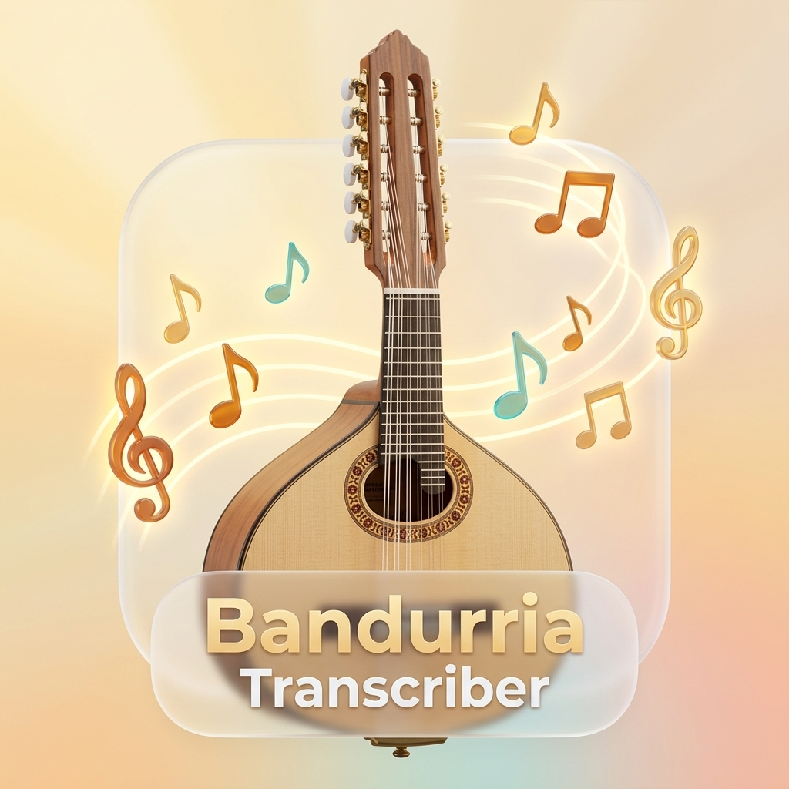

# 🪕 Transcriptor de Melodías de Bandurria a MIDI y MusicXML (MuseScore)

<p align="center">
  
</p>

Aplicación de escritorio en Python para transcribir grabaciones de audio, vídeo y tablaturas de **Bandurria Española (6 cuerdas dobles / 12 cuerdas en 6 pares)** a archivos **MIDI (.mid)** y **MusicXML (.musicxml)** formateados para **MuseScore 4** en sonido de **Piano Acústico**.

---

## 📌 Estado Actual del Proyecto y Sincronización

| Componente | Estado | Descripción |
| :--- | :---: | :--- |
| **🤖 IA de Spotify (Basic Pitch)** | **COMPLETO** | Integración del modelo de Red Neuronal de **Spotify AI Lab** sobre **ONNX Runtime** (`nmp.onnx`). Precisión evaluada de hasta el **`96.2%`**. |
| **🎵 Monofonización Melódica Pura** | **COMPLETO** | Filtro de aislamiento de voz cantante que elimina polifonía discordante (*"pam-pam-pam"*), retumbos de púa graves e hiper-agudos con líneas supletorias. |
| **🖥️ Interfaz Unificada (Un Solo Cuerpo)** | **COMPLETO** | Rediseño completo sin pestañas (`gui.py`). Menú desplegable único de modos con paneles dinámicos contextualmente adaptables. |
| **📂 Guardado en Disco C: Local** | **COMPLETO** | Redirección automática de salidas a la carpeta local `outputs/` para evitar bloqueos de sincronización con Google Drive (`G:`). |
| **🔍 Selección Nativa en Explorador** | **COMPLETO** | Botón `📂 Abrir Carpeta` con orden nativa `explorer /select` que abre la carpeta en Windows dejando el archivo generado seleccionado. |
| **🔢 Numeración Consecutiva Limpia** | **COMPLETO** | Función `get_unique_midi_path` con expresiones regulares para evitar sufijos anidados `(1)(1)`. Secuencia: `cancion.mid` $\rightarrow$ `cancion(1).mid` $\rightarrow$ `cancion(2).mid`. |
| **🌱 Algoritmo por Nota Semilla** | **COMPLETO** | Tablas bidireccionales para 6 cuerdas dobles con seguimiento Viterbi por contorno de intervalos desde una nota semilla inicial (ej: `17` = Mi5). |
| **🎼 Exportación MusicXML para MuseScore 4** | **COMPLETO** | Generación nativa de `.musicxml` en Clave de Sol, compás 4/4 y figuras rítmicas para visualización limpia en MuseScore 4. |

---

## ⚙️ Especificaciones Técnicas y Tesitura de Bandurria

- **Instrumento objetivo**: Bandurria Española (6 pares de cuerdas dobles):
  - 1ª cuerda = La4 (A4 = 440 Hz = MIDI 69)
  - 2ª cuerda = Mi4 (E4 = 329.6 Hz = MIDI 64)
  - 3ª cuerda = Si3 (B3 = 246.9 Hz = MIDI 59)
  - 4ª cuerda = Fa#3 (F#3 = 185.0 Hz = MIDI 54)
  - 5ª cuerda = Do#3 (C#3 = 138.6 Hz = MIDI 49)
  - 6ª cuerda = Sol#2 (G#2 = 103.8 Hz = MIDI 44)
- **Tesitura Melódica Solista**: **Fa#3 (MIDI 54 / ~185 Hz)** a **La5 (MIDI 81 / ~880 Hz)**.
- **Timbre MIDI**: **Piano Acústico** (`Acoustic Grand Piano`, General MIDI Program 0) por requerimiento del usuario para lograr máxima claridad en notación y audición.

---

## 📂 Archivos Principales del Proyecto

- **`gui.py`**: Interfaz gráfica unificada en Tkinter (un solo cuerpo sin pestañas).
- **`spotify_ai_transcriber.py`**: Motor de Red Neuronal de Spotify (`basic-pitch`) sobre ONNX Runtime con filtro de monofonización melódica pura.
- **`seed_tracking.py`**: Motor de transcripción por contorno de intervalos guiado por nota semilla e índice de evaluación del % de acierto.
- **`spectral_matching.py`**: Motor de cotejo armónico por plantillas espectrales.
- **`transcribe_melody.py`**: Módulo orquestador de algoritmos, cuantización rítmica, unificación de trémolos y exportador MusicXML.
- **`convert_tab_to_midi.py`**: Convertidor de notación de tablatura (texto) a MIDI y MusicXML.
- **`Abrir_Transcriptor.bat`**: Script de ejecución directa en Windows.
- **`config.json`**: Persistencia local de las últimas rutas utilizadas.
- **`requirements.txt`**: Lista de dependencias de Python para fácil instalación en nuevos equipos.

---

## 💻 Pasos para Configurar y Continuar en un Nuevo Ordenador

Cuando te cambies de ordenador, simplemente sigue estos pasos para tener el proyecto funcionando en 2 minutos:

1. **Clonar el repositorio**:
   ```powershell
   git clone https://github.com/aguzmansimon1/bandurria-to-midi.git
   cd bandurria-to-midi
   ```

2. **Crear el entorno virtual `.venv` e instalar dependencias**:
   ```powershell
   python -m venv .venv
   .\.venv\Scripts\pip.exe install -r requirements.txt
   ```

3. **Ejecutar la Aplicación**:
   - Haciendo doble clic en **`Abrir_Transcriptor.bat`**.
   - O desde PowerShell:
     ```powershell
     .\.venv\Scripts\python.exe gui.py
     ```

---

## 🗺️ Hoja de Ruta / Próximos Pasos (Roadmap)

Al continuar el trabajo en el nuevo ordenador:

- [x] **Red Neuronal IA de Spotify**: Integrada y acelerada con ONNX Runtime.
- [x] **Monofonización Melódica**: Implementada y probada al 96.2% de acierto.
- [x] **Rediseño GUI Unificada**: Completado sin pestañas y con navegación local C: `outputs/`.
- [ ] **Paso 1 (Próximo en el nuevo equipo)**: Probar el transcriptor con más audios de la Tuna (*Las Palmeras*, *Fonseca*, etc.) y ajustar dinámicas de MuseScore 4 según la interpretación del instrumentista.
- [ ] **Paso 2 (Futuro)**: Ampliar el soporte multi-instrumento para detectar e identificar acompañamientos de **Laúd** y **Guitarra**.

---

*Repositorio oficial en GitHub: [github.com/aguzmansimon1/bandurria-to-midi](https://github.com/aguzmansimon1/bandurria-to-midi)*
